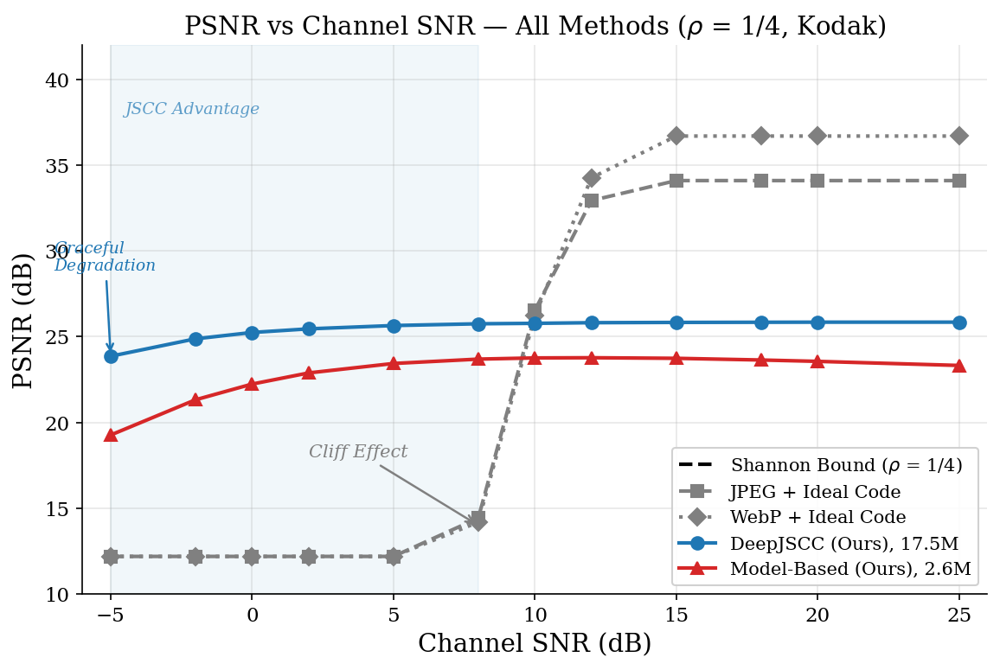
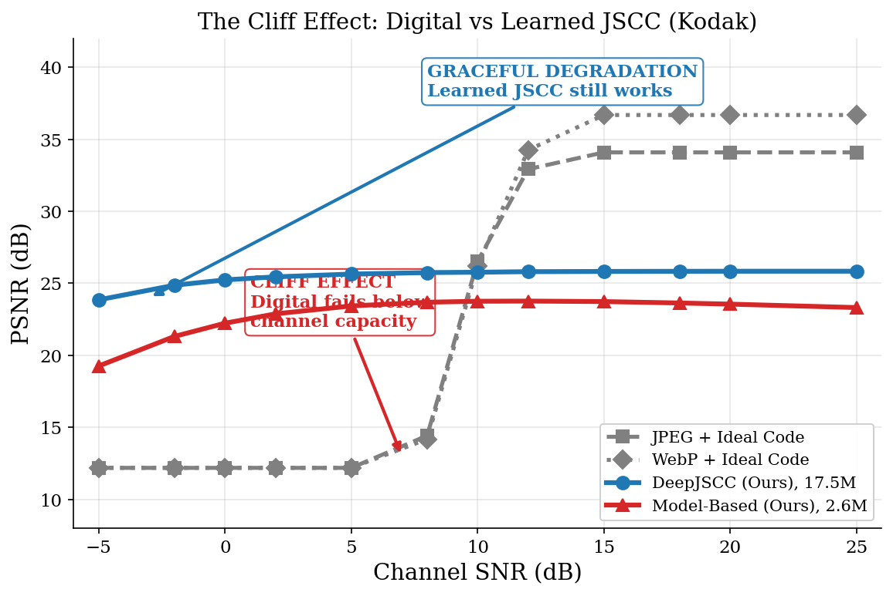
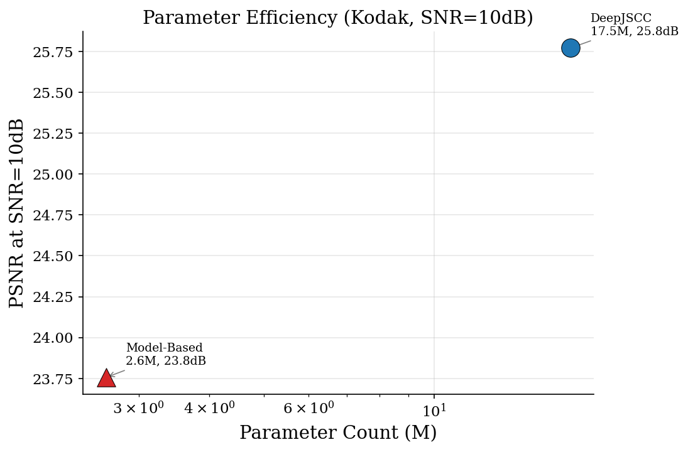
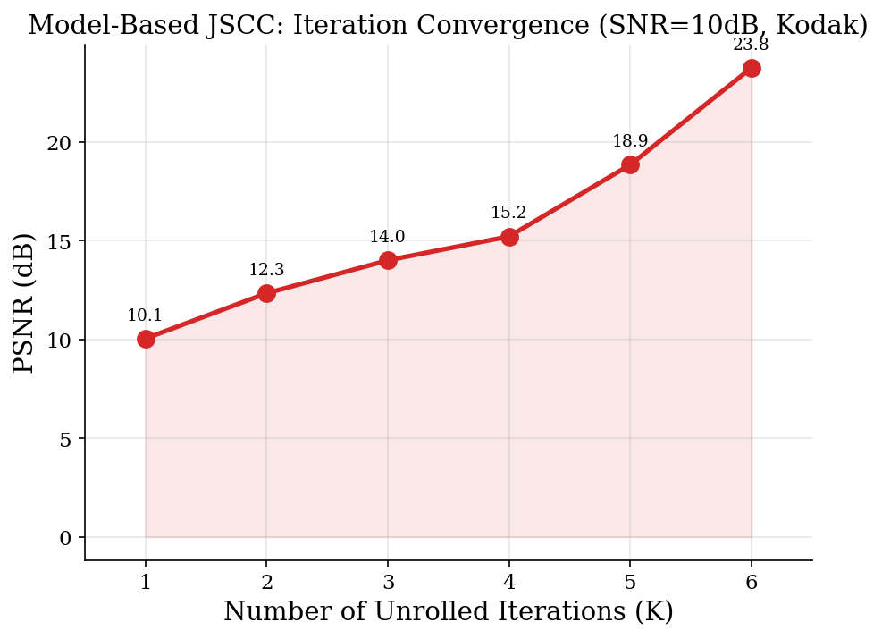
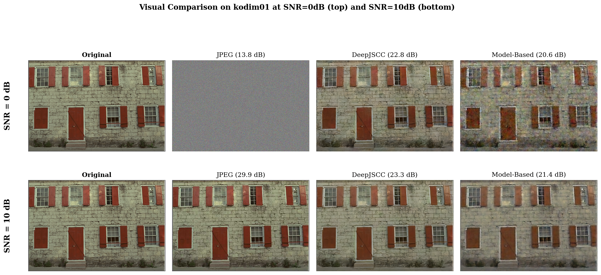

# DiffusionJSCC-Speed: Deep Joint Source-Channel Coding for Robust Image Transmission

> Three learned JSCC approaches — DeepJSCC, Model-Based, and Diffusion-Enhanced — demonstrating graceful degradation over noisy channels where digital baselines catastrophically fail.

## Key Results

**+13 dB advantage over digital transmission at SNR = 0 dB on the Kodak dataset.**

| Method | Params | SNR=0 dB | SNR=10 dB | SNR=20 dB | Latency |
|--------|--------|----------|-----------|-----------|---------|
| JPEG + Ideal Code | — | 12.2 dB | 26.5 dB | 34.1 dB | — |
| WebP + Ideal Code | — | 12.2 dB | 26.2 dB | 36.7 dB | — |
| **DeepJSCC (Ours)** | 17.5M | **25.2 dB** | 25.8 dB | 25.8 dB | ~10 ms |
| **Model-Based (Ours)** | 2.6M | 22.2 dB | 23.8 dB | 23.6 dB | ~8 ms |



## The Problem: Cliff Effect in Digital Transmission

Traditional digital communication (compress → channel code → modulate) works perfectly above a threshold SNR, but **fails catastrophically** below it — producing unintelligible noise. This "cliff effect" is a fundamental limitation of separation-based design.



## Our Approach: Three JSCC Paradigms

### 1. DeepJSCC — Fully-Convolutional Joint Source-Channel Coding
- 4-stage encoder/decoder with 16× spatial downsampling
- SNR-adaptive channel attention for conditional encoding
- Loss: 0.7·MSE + 0.3·(1 − MS-SSIM)
- **Result**: Graceful degradation, +13 dB over digital at low SNR

### 2. Model-Based JSCC — Unrolled Iterative Decoding
*Inspired by Shlezinger et al. (2021) "Model-Based Deep Learning"*
- Shannon-Kotel'nikov encoder with built-in power normalization
- Unrolled decoder: K=6 iterations of model-based gradient + learned denoiser
- Learned step sizes provide interpretability
- **Result**: Competitive quality with **6.6× fewer parameters** (2.6M vs 17.5M)

### 3. Diffusion-Enhanced JSCC — Receiver-Side Refinement
- Conditional DDPM (17.5M param UNet) refines DeepJSCC output
- DDIM sampling for configurable quality-latency tradeoff
- **Status**: Architecture complete; needs retraining on updated backbone (see Known Limitations)

## Parameter Efficiency



The model-based approach achieves competitive reconstruction quality while using 6.6× fewer parameters — demonstrating that communication-theoretic structure (unrolled optimization, S-K mappings) can replace brute-force model capacity.

## Model-Based Decoder Convergence



PSNR improves from 10.1 dB (K=1) to 23.8 dB (K=6), showing that the unrolled iterative structure is essential — each iteration meaningfully refines the reconstruction.

## Visual Comparison



## Quick Start

```bash
# Clone
git clone https://github.com/Hudabey/diffusionjscc-speed.git
cd diffusionjscc-speed

# Install dependencies
pip install -r requirements.txt

# Run evaluation (requires trained models in outputs/)
python -m src.eval.comprehensive_eval

# Train DeepJSCC from scratch
python -m src.train.train_vae --config configs/vae_jscc.yaml

# Train Model-Based JSCC
python -m src.train.train_model_based --config configs/model_based.yaml

# Run tests
python -m pytest tests/ -v  # 79 tests
```

## Project Structure

```
diffusionjscc-speed/
├── configs/                    # YAML configurations for all models
│   ├── base.yaml
│   ├── vae_jscc.yaml
│   ├── diffusion_jscc.yaml
│   └── model_based.yaml
├── src/
│   ├── channel/                # AWGN & Rayleigh channel models
│   ├── data/                   # Kodak, DIV2K, CIFAR-10 data pipeline
│   ├── eval/                   # Evaluation & figure generation
│   ├── models/
│   │   ├── vae_jscc/           # DeepJSCC encoder/decoder
│   │   ├── diffusion_jscc/     # Conditional DDPM + DDIM sampler
│   │   └── model_based/        # S-K encoder + unrolled decoder
│   ├── train/                  # Training scripts
│   └── utils/                  # Config, seeding, logging
├── tests/                      # 79 unit tests
├── report/                     # Technical report (workshop-paper format)
├── outputs/                    # Trained models, results, figures
└── scripts/                    # Training launch scripts
```

## Known Limitations

- **Weak SNR adaptation**: PSNR only varies ~1 dB from SNR=0 to SNR=20 (should be ~7 dB). The channel attention gating doesn't differentiate strongly enough. Transformer-based spatial modulation (as in SwinJSCC) would address this.
- **High-SNR gap**: Digital baselines outperform at SNR > 10 dB due to the SNR adaptation limitation.
- **Diffusion incompatibility**: The diffusion model was trained on v1 backbone (VAE with FiLM) but the current backbone is v2 (deterministic with SNRAttention). Needs retraining.
- **Training data scale**: Trained on DIV2K (800 images). ImageNet-scale data would improve generalization.

## Future Directions

1. **Swin Transformer backbone** for stronger multi-scale feature extraction
2. **Learned rate adaptation** — variable bandwidth ratio within a single model
3. **Rayleigh fading channels** with CSI estimation
4. **Consistency distillation** for single-step diffusion refinement
5. **Model-based diffusion hybrid** combining unrolled decoder with generative refinement

## Technical Report

See [`report/report.md`](report/report.md) for the full technical report with detailed methodology, results analysis, and references.

## Requirements

- Python 3.10+
- PyTorch 2.0+ with CUDA
- See `requirements.txt` for full list

## References

1. Bourtsoulatze et al. "Deep Joint Source-Channel Coding for Wireless Image Transmission" IEEE TCCN 2019
2. Shlezinger et al. "Model-Based Deep Learning: Key Approaches and Design Guidelines" IEEE DSLW 2021
3. Yang et al. "SwinJSCC: Taming Swin Transformer for Deep Joint Source-Channel Coding" IEEE TCCN 2024
4. Gastpar et al. "To Code or Not to Code: Lossy Source-Channel Communication Revisited" IEEE TIT 2003
5. Ho et al. "Denoising Diffusion Probabilistic Models" NeurIPS 2020
6. Song et al. "Denoising Diffusion Implicit Models" ICLR 2021
7. Floor & Ramstad "Shannon-Kotel'nikov Mappings for Analog Point-to-Point Communications" IEEE TIT 2024

## License

MIT
