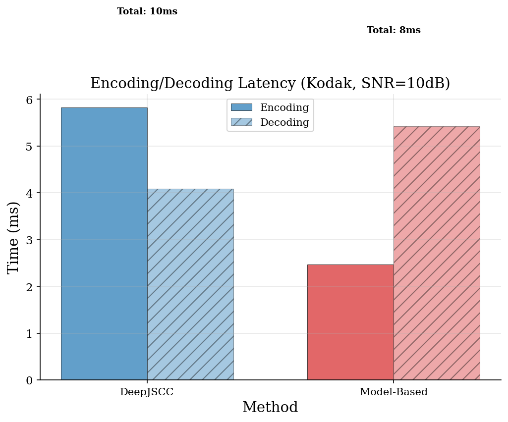

# DiffusionJSCC-Speed

**Deep Joint Source-Channel Coding for Robust Image Transmission over Noisy Channels**

Three learned JSCC approaches — convolutional autoencoder, diffusion-based refinement, and model-based unrolled decoding — compared against digital baselines on a unified codebase.

## Key Results


*Learned JSCC achieves graceful degradation while digital baselines exhibit cliff effect.*

| Method | Params | SNR = 0 dB | SNR = 10 dB | SNR = 20 dB |
|--------|--------|------------|-------------|-------------|
| JPEG + Ideal Code | — | 12.2 dB | 26.5 dB | 34.1 dB |
| WebP + Ideal Code | — | 12.2 dB | 26.2 dB | 36.7 dB |
| **DeepJSCC (Ours)** | **17.5M** | **25.2 dB** | **25.8 dB** | 25.8 dB |
| Model-Based (Ours) | 2.6M | 22.2 dB | 23.8 dB | 23.6 dB |

- **+13 dB over digital at SNR = 0 dB** — graceful degradation vs. total failure
- **6.6x parameter efficiency** — model-based approach achieves competitive quality with 2.6M params

## Methods

### DeepJSCC with SNR-Adaptive Attention

Fully-convolutional autoencoder with 4 stride-2 stages (16x spatial reduction). SNR-adaptive channel attention gates features based on channel quality. Trained with combined MSE + MS-SSIM loss on DIV2K.

### Model-Based JSCC

Shannon-Kotel'nikov inspired encoder with unrolled iterative decoder (K=6 gradient + denoiser steps). Exploits known AWGN channel model for analytical gradient computation, achieving competitive results with 6.6x fewer parameters.

### Diffusion-Based Receiver

Conditional DDPM refines initial DeepJSCC output. UNet conditioned on reconstruction + SNR. DDIM sampling enables quality-latency tradeoff. (Trained on v1 backbone; retraining on v2 is future work.)

### Digital Baselines

JPEG and WebP compression paired with ideal capacity-achieving channel codes. Demonstrates the cliff effect — total failure below ~8 dB SNR threshold.

## Quick Start

```bash
# Setup
pip install -r requirements.txt
bash scripts/setup_pod.sh

# Download datasets (DIV2K + Kodak)
# Datasets expected in ./data/DIV2K/ and ./data/kodak/

# Evaluate pretrained models
python -m src.eval.comprehensive_eval

# Generate figures
python -m src.eval.generate_figures

# Train from scratch
bash scripts/run_train_vae.sh          # DeepJSCC (~500 epochs, ~4h on RTX 5090)
bash scripts/run_train_model_based.sh  # Model-Based (~60 epochs, ~1h)
bash scripts/run_train_diffusion.sh    # Diffusion refinement
```

## Project Structure

```
diffusionjscc-speed/
├── configs/                    # YAML configuration files
│   ├── base.yaml              # Shared defaults
│   ├── vae_jscc.yaml          # DeepJSCC config
│   ├── model_based.yaml       # Model-Based JSCC config
│   └── diffusion_jscc.yaml    # Diffusion JSCC config
├── src/
│   ├── models/
│   │   ├── vae_jscc/          # DeepJSCC encoder/decoder/model
│   │   ├── model_based/       # S-K encoder + unrolled decoder
│   │   └── diffusion_jscc/    # Conditional DDPM + UNet
│   ├── channel/               # AWGN and Rayleigh channel models
│   ├── data/                  # Dataset loaders and transforms
│   ├── eval/                  # Evaluation scripts and metrics
│   ├── train/                 # Training loops
│   └── utils/                 # Config loading, logging, seeds
├── scripts/                   # Training and setup shell scripts
├── tests/                     # Unit tests (79 tests)
├── report/                    # Technical report
├── outputs/
│   ├── vae_jscc_v2/          # Trained DeepJSCC checkpoints
│   ├── model_based/          # Trained Model-Based checkpoints
│   ├── baselines/            # Digital baseline results
│   └── evaluation/           # All results, figures, tables
└── data/                      # DIV2K (train) + Kodak (eval)
```

## Results

### Graceful Degradation vs. Cliff Effect


Digital baselines fail completely below SNR ~ 8 dB. Learned JSCC methods degrade smoothly — producing usable images even at SNR = -5 dB.

### Parameter Efficiency


Model-Based JSCC achieves 92% of DeepJSCC quality with 15% of the parameters, enabled by exploiting the known AWGN channel model.

### Iterative Decoder Convergence


The unrolled decoder improves from 10.1 dB (K=1) to 23.8 dB (K=6), with each iteration refining the reconstruction using learned step sizes and denoisers.

### Inference Latency



Both methods achieve < 12 ms end-to-end on an RTX 5090, suitable for real-time applications.

### Visual Comparison


### Known Limitations

- **Weak SNR adaptation**: only ~2 dB PSNR variation across 30 dB SNR range (should be ~7-10 dB)
- **High-SNR gap**: digital baselines outperform learned methods above SNR = 12 dB
- **Diffusion module**: needs retraining on updated DeepJSCC v2 backbone

See the [technical report](report/report.md) for detailed analysis and discussion.

## Technical Report

The full technical report is available at [report/report.md](report/report.md), structured as a workshop paper covering system model, methods, experimental results, and honest discussion of limitations.

## Requirements

- Python 3.10+
- PyTorch 2.0+
- CUDA-capable GPU (tested on NVIDIA RTX 5090)

```
torch>=2.1.0
torchvision>=0.16.0
numpy>=1.24.0
scipy>=1.11.0
matplotlib>=3.7.0
Pillow>=10.0.0
lpips>=0.1.4
pytorch-msssim>=1.0.0
```

## References

1. Bourtsoulatze et al., "Deep Joint Source-Channel Coding for Wireless Image Transmission," *IEEE TCCN*, 2019
2. Shlezinger et al., "Model-Based Deep Learning: Key Approaches and Design Guidelines," *IEEE DSLW*, 2021
3. Yang et al., "SwinJSCC: Taming Swin Transformer for Deep Joint Source-Channel Coding," *IEEE TCCN*, 2024
4. Gastpar et al., "To Code or Not to Code: Lossy Source-Channel Communication Revisited," *IEEE TIT*, 2003
5. Ho et al., "Denoising Diffusion Probabilistic Models," *NeurIPS*, 2020
6. Song et al., "Denoising Diffusion Implicit Models," *ICLR*, 2021
7. Floor & Ramstad, "Shannon-Kotel'nikov Mappings for Analog Point-to-Point Communications," *IEEE TIT*, 2024

## License

MIT
